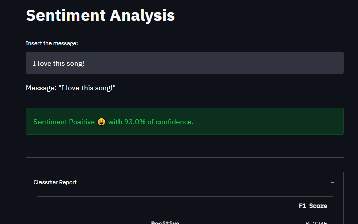

# Sentiment Analysis app!

Classifier - [Naive Bayes (Complement)](https://scikit-learn.org/stable/modules/generated/sklearn.naive_bayes.ComplementNB.html)
Vectorizer - [TF-IDF](https://scikit-learn.org/stable/modules/generated/sklearn.feature_extraction.text.TfidfVectorizer.html)
```
score on train: 0.9086
score on test:  0.7808
report on test:  precision    recall  f1-score   support

           0       0.77      0.81      0.79    184577
           2       0.80      0.75      0.77    183558

    accuracy                           0.78    368135
   macro avg       0.78      0.78      0.78    368135
weighted avg       0.78      0.78      0.78    368135

```
# Files:
`classifier.py`: Train and generate sentiment analyzer model
`preprocessing.py`: Preprocess all data used to train model and preprocess the new messages during inference mode
`app.py` : A simple app by [Streamlit](https://streamlit.io/)
`./data/`:  all data files used to train the classifier (could be downloaded [here](https://www.kaggle.com/kazanova/sentiment140))


## To run:
> `streamlit run .\app.py`



 